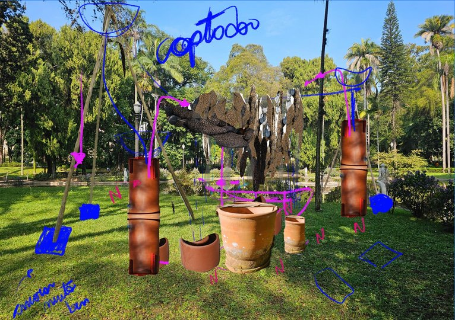
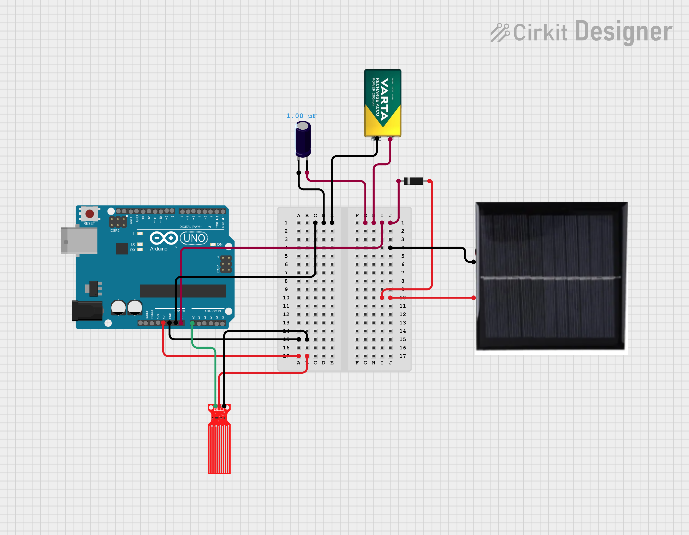

# Neosymbiota Lucens tentativa 1

Instruções de montagem para o trabalho Neosymbiota Lucens tentativa 1

## Funcionalidades

Integração do Arduino UNO com

* Placa solar: [ref 1](https://www.paraisodosbits.com.br/2016/11/09/usando-o-arduino-com-painel-solar/), [ref 2](https://www.instructables.com/Self-Sufficient-Arduino-Board/), [ref 3](https://docs.arduino.cc/learn/electronics/power-pins/)
* Bomba aquática submersível: [ref 1](https://www.youtube.com/watch?v=HBGYIuBC3BQ), [ref 2](https://www.youtube.com/watch?v=yZqnqxHI59Q)
* Sensor de nível de água [ref 1](https://produto.mercadolivre.com.br/MLB-4657915780-sensor-de-nivel-de-agua-analogico-para-arduino-_JM#polycard_client=search-nordic&position=31&search_layout=stack&type=item&tracking_id=9c86f469-73c1-46ce-bb7a-f6aa6aa08789&wid=MLB4657915780&sid=search) [ref 2](https://www.youtube.com/watch?v=2F528zFXesU), [ref 3](https://www.youtube.com/watch?v=Oien8iceuhc)

## Possibilidades

* Sensor de turbidez [ref 1](https://produto.mercadolivre.com.br/MLB-1726188669-modulo-sensor-de-turbidez-particulas-suspensas-na-agua-_JM?matt_tool=19390443&matt_internal_campaign_id=&matt_word=&matt_source=google&matt_campaign_id=22090354205&matt_ad_group_id=173090538676&matt_match_type=&matt_network=g&matt_device=c&matt_creative=727882727907&matt_keyword=&matt_ad_position=&matt_ad_type=pla&matt_merchant_id=218747052&matt_product_id=MLB1726188669&matt_product_partition_id=2389865440548&matt_target_id=pla-2389865440548&cq_src=google_ads&cq_cmp=22090354205&cq_net=g&cq_plt=gp&cq_med=pla&gad_source=1&gad_campaignid=22090354205&gclid=CjwKCAjwqKzEBhANEiwAeQaPVYmRu4_UUpcl3_pfdpKW1FKL-JcVovnwy2r7vF2jBa4bSRBaY1vR6RoCJw8QAvD_BwE), [ref 2](https://www.youtube.com/watch?v=BxOh81CjtuU): a turbidez pode ser entendida como a medida do espalhamento da luz produzido pela presença de partículas em suspensão sendo expressa como Unidade Nefelométrica de Turbidez. Nefelometria é o processo de medida da concentração de uma emulsão por comparação de sua transparência com a de uma preparação padrão.
* Sensor pH

## Componentes

Proposta de conexões com sensor de nível, bomba de água submersível e turbidez

* Sensor de nível da água
  * 5V
  * A0
  * GND
* Sensor de turbidez:
  * 5V -> V
  * GND -> G
  * A -> A1
* Bomba
* Placa solar
* Bateria 9V recarregável
* Capacitor 100uF 10V
* Diodo
  
