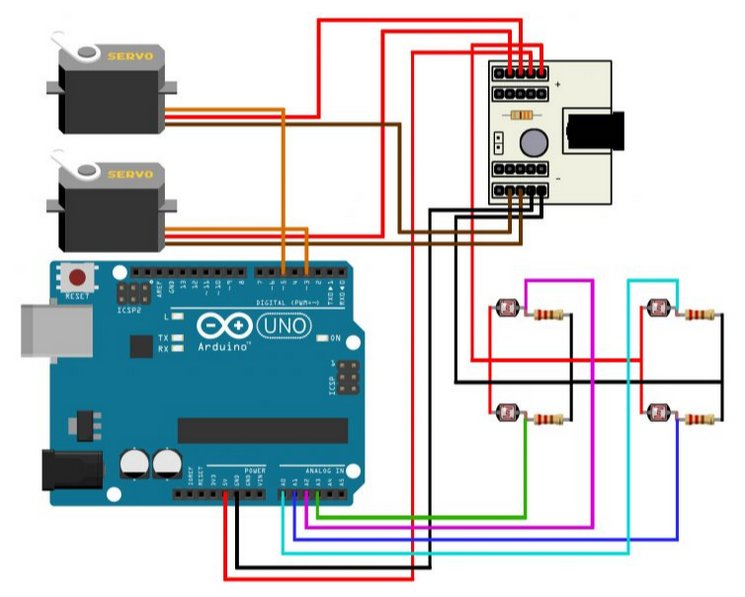
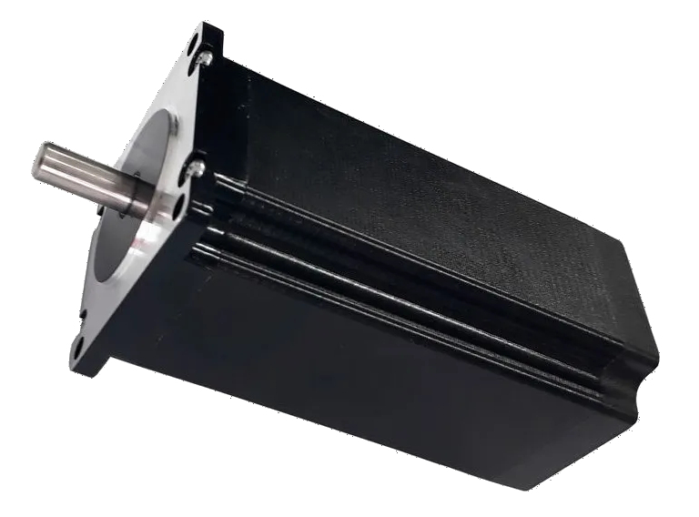
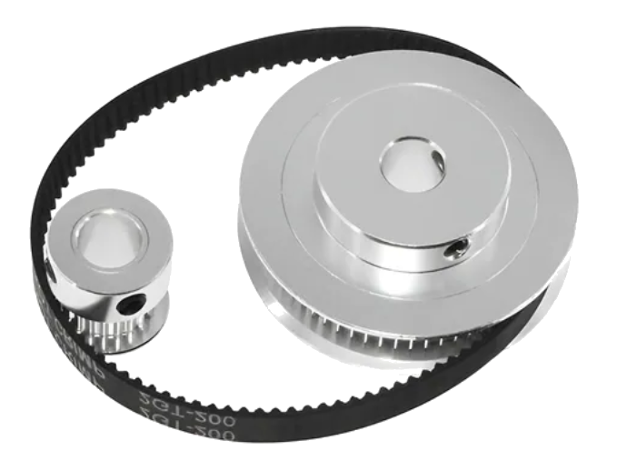
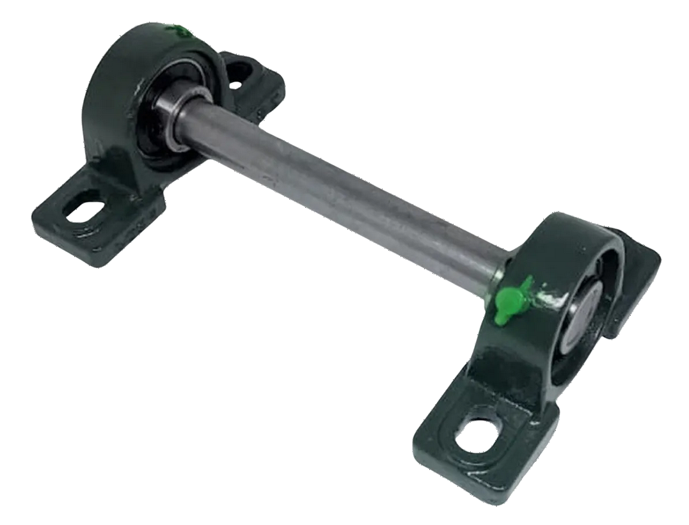
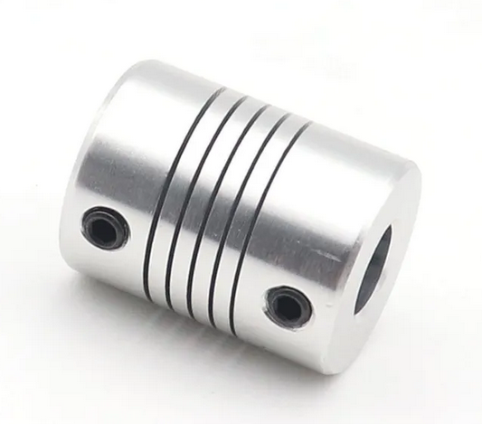

# Neosymbiota Lucens tentativa 1

Instruções de montagem para o trabalho Neosymbiota Lucens tentativa 1

Essa parte do trabalho (do rastreador de luz) foi montado a partir da [ref 1](https://www.usinainfo.com.br/blog/rastreador-solar-com-arduino-um-seguidor-solar-atraves-de-ldr/?srsltid=AfmBOopmhUIaa4iWFgExYoY_OMAmqnunysOihkISRG3wj58gcAvz8ka0).
O rastreador usa LDR (Light Dependent Resistor, isto é, resistores variáveis com a luz) para detectar a presença de luz em 4 quadrantes divididos por uma altura, de modo que faça sombra nos demais LDRs quando não está alinhado com a fonte de luz.
Para ajustar a posição do circuito de modo a se alinhar com a fonte de luz, foram usados 1 motor de passo Nema 23. O motor gira para cima e para baixo, na vertical.
```
|            |   
|     A0     |    
|-------------
|     A1     |     
|            |
```

O algoritmo funciona a partir da diferença entre a luz percebida entre os LDRs (conectados em A0, A1). Quando a luz tem mais intensidade:
- Acima, o motor vertical gira no sentido ANTI HORARIO
- Abaixo, o motor vertical gira no sentido HORARIO





Referências para o desenho [ref 1](https://www.usinainfo.com.br/blog/rastreador-solar-com-arduino-um-seguidor-solar-atraves-de-ldr/?srsltid=AfmBOopmhUIaa4iWFgExYoY_OMAmqnunysOihkISRG3wj58gcAvz8ka0) [ref 2](https://github.com/luisaburini/Swinging-the-chain)

## Funcionalidades

Integração do Arduino UNO com

* Rastreador de luz [ref 1](https://www.usinainfo.com.br/blog/rastreador-solar-com-arduino-um-seguidor-solar-atraves-de-ldr/?srsltid=AfmBOopmhUIaa4iWFgExYoY_OMAmqnunysOihkISRG3wj58gcAvz8ka0)
* Placa solar: [ref 2](https://www.paraisodosbits.com.br/2016/11/09/usando-o-arduino-com-painel-solar/), [ref 3](https://www.instructables.com/Self-Sufficient-Arduino-Board/), [ref 4](https://docs.arduino.cc/learn/electronics/power-pins/)
* Motor de passo NEMA + driver TB6600 [ref 5](https://www.youtube.com/watch?v=nLV0fjUWI-g) 

## Componentes

Proposta de conexões com 1 motor de passo e o circuito com 2 LDR para detectar a direção da luz

* Bomba
* Placa solar
* Bateria 9V recarregável
* 2 LDR
* 2 resistores 220 ohm
* [1 motor de passo 3A 45kgf cm](https://produto.mercadolivre.com.br/MLB-2028330458-motor-de-passo-nema-34-45kgfcm-3a-router-cnc-_JM#polycard_client=search-nordic&search_layout=grid&position=14&type=item&tracking_id=ecc9325b-f903-4968-a8a2-4356f20a9e44&wid=MLB2028330458&sid=search)

* [Driver para motor de passo TB6600](https://produto.mercadolivre.com.br/MLB-5272675760-placa-controladora-driver-motor-de-passo-4a-42v-tb6600-_JM#polycard_client=search-nordic&search_layout=stack&position=4&type=item&tracking_id=f14acee4-30a2-4d14-ba08-d87b7267c537&wid=MLB5272675760&sid=search)
* [1 kit de redução 4:1](https://produto.mercadolivre.com.br/MLB-4501588822-kit-reduco-gt2-41-10mm-2080-dentes-furo-5mm-correia-400mm-_JM#polycard_client=search-nordic&search)

* [Mancal + eixo](https://www.mercadolivre.com.br/02-mancal-pedestal-com-rolamento-ucp204--eixo-20mm-x-400mm/up/MLBU1975068392?pdp_filters=item_id%3AMLB3346182395#origin=share&sid=share&wid=MLB3346182395&action=copy)

* [1 acoplador 5mm (polia) para 12,7mm (motor) especificar no pedido](https://produto.mercadolivre.com.br/MLB-1608286009-acoplamento-rigido-varias-medidas-para-motor-_JM?matt_tool=92013967&matt_internal_campaign_id=&matt_word=&matt_source=google&matt_campaign_id=22603531565&matt_ad_group_id=184689824807&matt_match_type=&matt_network=g&matt_device=c&matt_creative=758138322203&matt_keyword=&matt_ad_position=&matt_ad_type=pla&matt_merchant_id=5439757935&matt_product_id=MLB1608286009&matt_product_partition_id=2425720730334&matt_target_id=aud-1966009190540:pla-2425720730334&cq_src=google_ads&cq_cmp=22603531565&cq_net=g&cq_plt=gp&cq_med=pla&gad_source=1&gad_campaignid=22603531565&gclid=Cj0KCQjw58PGBhCkARIsADbDilx1ZdUIPXbaFDZqbduLQUmVu4lyq1_-u31c1q-Mtnt8WzUd3ycn9ScaAgO0EALw_wcB)
* [1 acoplador 5mm (polia) para 19mm (eixo) especificar no pedido](https://produto.mercadolivre.com.br/MLB-1608286009-acoplamento-rigido-varias-medidas-para-motor-_JM?matt_tool=92013967&matt_internal_campaign_id=&matt_word=&matt_source=google&matt_campaign_id=22603531565&matt_ad_group_id=184689824807&matt_match_type=&matt_network=g&matt_device=c&matt_creative=758138322203&matt_keyword=&matt_ad_position=&matt_ad_type=pla&matt_merchant_id=5439757935&matt_product_id=MLB1608286009&matt_product_partition_id=2425720730334&matt_target_id=aud-1966009190540:pla-2425720730334&cq_src=google_ads&cq_cmp=22603531565&cq_net=g&cq_plt=gp&cq_med=pla&gad_source=1&gad_campaignid=22603531565&gclid=Cj0KCQjw58PGBhCkARIsADbDilx1ZdUIPXbaFDZqbduLQUmVu4lyq1_-u31c1q-Mtnt8WzUd3ycn9ScaAgO0EALw_wcB)
