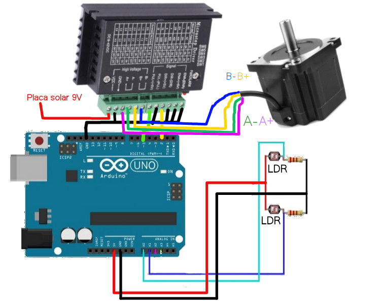

# Neosymbiota Lucens tentativa 1

Instruções de montagem para o trabalho Neosymbiota Lucens tentativa 1

## Funcionalidades

Integração do Arduino UNO com

* Placa solar: [ref 1](https://www.paraisodosbits.com.br/2016/11/09/usando-o-arduino-com-painel-solar/), [ref 2](https://www.instructables.com/Self-Sufficient-Arduino-Board/), [ref 3](https://docs.arduino.cc/learn/electronics/power-pins/)
* Bomba aquática submersível: [ref 1](https://www.youtube.com/watch?v=HBGYIuBC3BQ), [ref 2](https://www.youtube.com/watch?v=yZqnqxHI59Q)

## Componentes

Proposta de conexões com 2 motores servo e o circuito com 4 LDR para detectar a direção da luz

* Bomba
* Placa solar
* Bateria 9V recarregável
* 4 LDR
* 4 resistores 220 ohm
* 2 servo motores